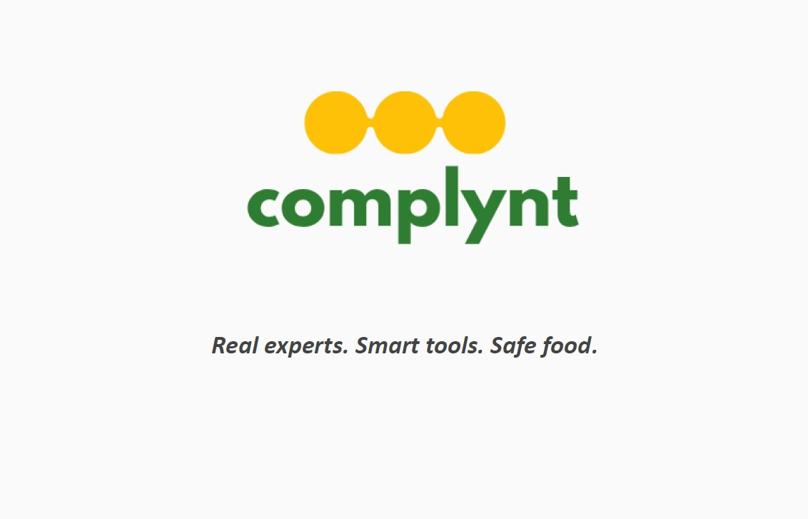

[Link to the financial model](https://github.com/GokulLD/Complynt_New-Venture-Capstone-Project/raw/refs/heads/main/financial%20model%20(2).xlsx)

This is the 3-statement financial model I built for my New Venture Capstone Project - 'Complynt'. The model forecasts three possible scenarios, and tries to predict the free cash flow/additional capital requirements in each case.

'Complynt' aims to provide AI-powered, next-generation compliance tools for small food producers at an affordable price point, to handle food labelling compliance, HACCP compliance, and other related regulatory filings. Complynt also provides a marketplace with CFIA-certified expert consultants for the platform's subscribers, where they can validate their food labels, HACCP charts, and get all their queries resolved.
